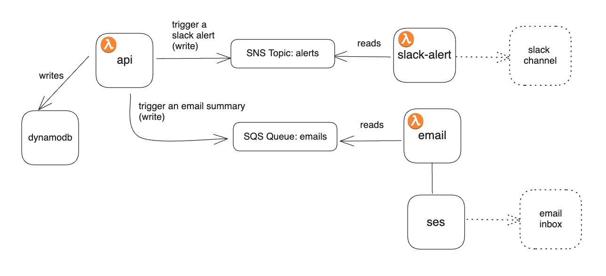

# retroboard

retroboard is a app written in **python** to create kanban boards that can be used for different purposes like capturing notes for a [Retrospective](https://www.atlassian.com/agile/scrum/retrospectives) meeting, creating a Pros/Cons list, tracking TODOs, etc.

This app demonstrates a serverless application with multiple functions that can be deployed to **Lambdas**, uses **DynamoDB** for data storage and **SES** for sending summary emails. The UI of the app can be served with S3.

---

StackGen provides a powerful and flexible way to define and manage your infrastructure. We encourage you to use StackGen to generate IaC for this application and try and deploy this app in your own AWS Account. 

Get started with IaC generation for this repo by following the instructions on [StackGen Documentation](https://docs.stackgen.com/get-started)


### Environment Variables

- functions/email-summary
```
SES_SENDER_EMAIL_ADDRESS - email address from which the summary email will be sent
```

- functions/slack-alerts
```
SLACK_WEBHOOK_URL - slack webhook url to send alerts when a new board is created
```

### Architecture




## Other Sample Projects to try

- [hello-kitty](https://github.com/StackGen-demo/hello-kitty) - a static website that can be deployed to Lambda and S3


## License

This project is licensed under the MIT License. See the [LICENSE](LICENSE) file for details.
