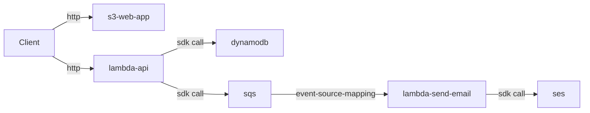

# retroboard

sample app for serverless stack that uses dynamodb, lambda, s3, ses

## development

- export the following environment variables

```
export SES_SENDER_EMAIL_ADDRESS=email
export SES_SUMMARY_EMAIL_TEMPLATE_NAME=board-summary
export DYNAMODB_TABLE_NAME=boards
```

- run the server

```
cd api
pipenv --python 3.8
pipenv install
pipenv shell
fastapi dev main.py
```

- swagger docs: localhost:8000/redoc

---


---

## app - retroboard
- boards have sections
- sections have notes

## other features :)
- no auth
- anyone can update any note on a board
- anyone can access a board if they have the link
- no limit on votes


## infra requirements
- have an email verified in ses to send summary emails


## future improvements
- lambda destinations: add a DLQ and redrive policy to retry failed emails
- websocket api: websocket for real-time updates
- lambda layers: create a lambda layer for the dependencies
