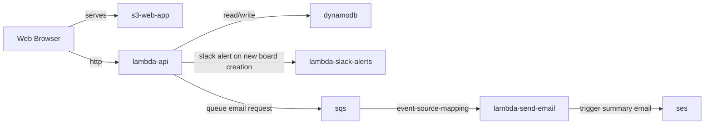

# retroboard

retroboard is a app written in **python** to create kanban boards that can be used for different purposes like capturing notes for a [Retrospective](https://www.atlassian.com/agile/scrum/retrospectives) meeting, creating a Pros/Cons list, tracking TODOs, etc.

This app demonstrates a serverless application with multiple functions that can be deployed to **Lambdas**, uses **DynamoDB** for data storage and **SES** for sending summary emails. The UI of the app can be served with S3.

appCD provides a powerful and flexible way to define and manage your infrastructure. We encourage you to use appCD to generate IaC for this application and try and deploy this app in your own AWS Account. 

Get started with IaC generation for this repo by following the instructions on [appCD Documentation](https://docs.appCD.io/getting-started)

## License

This project is licensed under the MIT License. See the [LICENSE](LICENSE) file for details.
